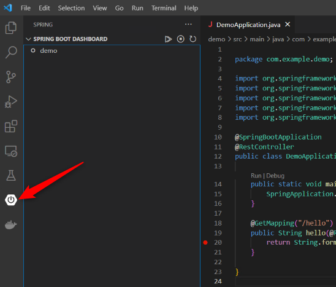
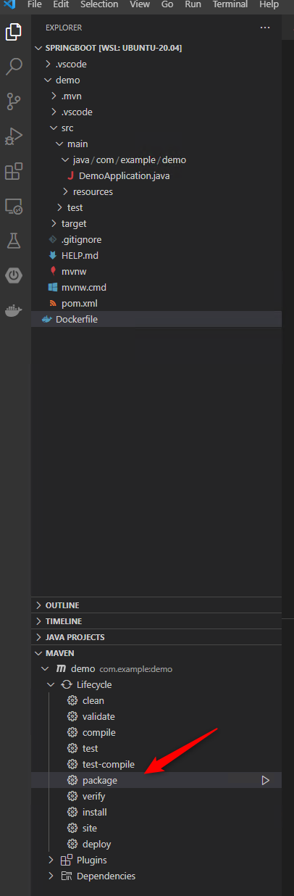

# Spring Boot on Container/Kubernetes を始めるチュートリアル

## 1. Spring Boot の開発

参考ドキュメント: [Spring Quickstart Guide](https://spring.io/quickstart)

### 1.1 開発環境の準備

- [Install Linux on Windows with WSL](https://docs.microsoft.com/en-us/windows/wsl/install)
  - Windows 上で Linux 環境を実行する
- [SDKMAN! the Software Development Kit Manager](https://sdkman.io/)
  - JDK や Maven 等のインストールが簡単にできる

```bash
# SDKMAN に必要なパッケージのインストール
sudo apt install zip unzip
# SDKMAN のインストール
curl -s "https://get.sdkman.io" | bash
# OpenJDK(Microsoft) のインストール
sdk install java 17.0.4.1-ms
```

### 1.2 Git の準備

- [.gitignore のダウンロード](https://github.com/github/gitignore/blob/main/Java.gitignore)

### 1.3 IDE (Visual Studio Code) の準備

#### 拡張機能のインストール

- [Extension Pack for Java](https://marketplace.visualstudio.com/items?itemName=vscjava.vscode-java-pack)
- [Spring Boot Extension Pack](https://marketplace.visualstudio.com/items?itemName=pivotal.vscode-boot-dev-pack)
  - Spring Boot Tools, Spring Initializr, Spring Boot Dashboard が含まれている

- 参考ドキュメント: [Spring Boot in Visual Studio Code](https://code.visualstudio.com/docs/java/java-spring-boot)

### 1.4 Spring Boot Initializr によるテンプレートの作成

1. コマンドパレットから Spring Boot Initializr を起動する
2. `Select dependencies to add.` で `Spring Web` を選択する
    1. [手順動画](https://code.visualstudio.com/docs/java/java-spring-boot/spring-initializr.mp4)

### 1.5 コードの追加

`DemoApplication.java` を以下のコードで置き換え。

```java
package com.example.demo;
import org.springframework.boot.SpringApplication;
import org.springframework.boot.autoconfigure.SpringBootApplication;
import org.springframework.web.bind.annotation.GetMapping;
import org.springframework.web.bind.annotation.RequestParam;
import org.springframework.web.bind.annotation.RestController;

@SpringBootApplication
@RestController
public class DemoApplication {
    public static void main(String[] args) {
    	SpringApplication.run(DemoApplication.class, args);
    }
    
    @GetMapping("/hello")
    public String hello(@RequestParam(value = "name", defaultValue = "World") String name) {
    	return String.format("Hello %s!", name);
    }
}
```

<details>
  <summary>Option</summary>

```java
package com.example.demo;

import java.util.Enumeration;

import org.springframework.boot.SpringApplication;
import org.springframework.boot.autoconfigure.SpringBootApplication;
import org.springframework.web.bind.annotation.GetMapping;
import org.springframework.web.bind.annotation.RequestParam;
import org.springframework.web.bind.annotation.RestController;

import jakarta.servlet.http.HttpServletRequest;

@SpringBootApplication
@RestController
public class DemoApplication {

    public static void main(String[] args) {
        SpringApplication.run(DemoApplication.class, args);
    }

    @GetMapping("/hello")
    public String hello(@RequestParam(value = "name", defaultValue = "World") String name, HttpServletRequest request) {
        // output all http headers
        Enumeration<String> headerNames = request.getHeaderNames();
        StringBuilder headers = new StringBuilder();
        while (headerNames.hasMoreElements()) {
            String headerName = headerNames.nextElement();
            headers.append(headerName).append(": ").append(request.getHeader(headerName)).append("\n");
        }
        headers.append("remote addr: ").append(request.getRemoteAddr()).append("\n");
        // Get hostname from environment variable
        headers.append("hostname: ").append(System.getenv("HOSTNAME")).append("\n");
        System.out.println(headers.toString());
        // Print headers as HTML
        return String.format("<html><body><h1>Hello %s!</h1><pre>%s</pre></body></html>", name, headers.toString());
        // return String.format("Hello %s!", name);
    }
}
```

</details>

### 1.6 デバッグ

#### CLI から実行

```bash
./mvnw spring-boot:run
```
`demo` ディレクトリに移動していない場合は最初に移動する。


#### Visual Studio Code から実行

拡張機能の `Spring` から Run もしくは Debug を実行。



## 2. コンテナイメージの作成

参考ドキュメント: [Spring Boot with Docker](https://spring.io/guides/gs/spring-boot-docker/)

### 2.1 パッケージのビルド(Jar ファイルの生成)

#### CLI から実行

```bash
./mvnw package
```

#### Visual Studio Code から実行



### 2.2 Dockerfile の作成

- JDK に Microsoft の OpenJDK を使用
- OS に Alpine を使用

```dockerfile
FROM mcr.microsoft.com/openjdk/jdk:17-distroless
ARG JAR_FILE=demo/target/*.jar
COPY ${JAR_FILE} app.jar
ENTRYPOINT ["java","-jar","/app.jar"]
```

### 2.3 Docker イメージのビルド

```bash
docker build -t <レジストリ名>/demo-spring-openjdkms:mariner .
```

Docker イメージのテスト:

```bash
docker run -p 8080:8080 <レジストリ名>/demo-spring-openjdkms:mariner
```

コンテナ起動後、ブラウザで `http://localhost:8080/hello` にアクセスする。

### 2.4 Docker イメージの Push

あらかじめ `docker login` 等でレジストリへログインする。

```bash
docker push <レジストリ名>/demo-spring-openjdkms:mariner
```

## 3. Kubernetes への展開

### 3.1 YAML ファイルの作成 とデプロイ

以下のファイルを `deploy.yaml` として保存する。

```yaml
apiVersion: apps/v1
kind: Deployment
metadata:
  labels:
    app: demo-springboot
  name: demo-springboot
spec:
  replicas: 2
  selector:
    matchLabels:
      app: demo-springboot
  template:
    metadata:
      creationTimestamp: null
      labels:
        app: demo-springboot
    spec:
      containers:
      - image: tsubasaxzzz/demo-spring-openjdkms:mariner
        name: demo-spring-openjdkms-mariner
```

Kubernetes への展開

```bash
kubectl apply -f deploy.yaml
```

### 3.3 Service の作成 (Optional)

```bash
kubectl expose deployment demo-springboot --type LoadBalancer --target-port 8080 --port 80
```

## Tips

### Microsoft の JDK と コンテナイメージ

[Container images for the Microsoft Build of OpenJDK](https://docs.microsoft.com/en-us/java/openjdk/containers)
